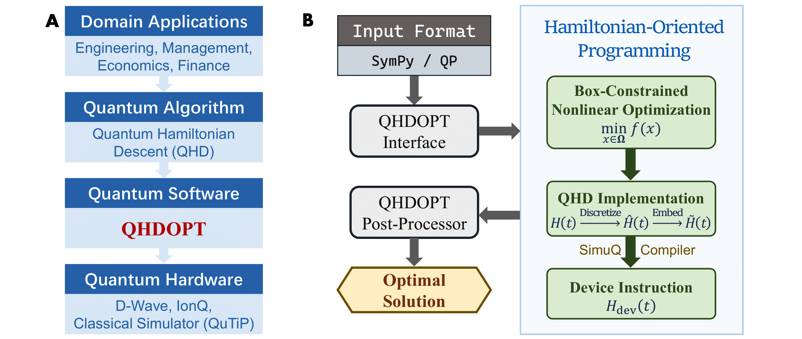

# QHDOPT

[](https://unitary.fund)<br>
[](https://github.com/jiaqileng/QHDOPT/actions/workflows/python-ci.yml)
[](https://codecov.io/gh/jiaqileng/QHDOPT)
<br>
**QHDOPT** (QHD-based OPTimizer) is a software package for nonconvex optimization.

QHDOPT implements a quantum optimization algorithm named [Quantum Hamiltonian Descent](https://jiaqileng.github.io/quantum-hamiltonian-descent/) (QHD) on available quantum computers (such as the [D-Wave systems](https://www.dwavesys.com/)). QHD is a quantum-upgraded version of gradient descent (GD). Unlike the classical GD, QHD demonstrates a significant advantage in solving nonconvex optimization problems.

<p align="center">

</p>

## Why QHDOPT?

#### QHDOPT is for everyone!
QHDOPT aims to eliminate the technical barrier of using QHD for the broader operations research (OR) community. We do not assume users to have prior knowledge of quantum computing, while we allow expert users to specify advanced solver parameters for customized experience. Our target users include:

- Professionals pursuing an *off-the-shelf* nonconvex optimization solver to tackle problems in operations research (e.g., power systems, supply chains, manufacturing, health care, etc.),
- Researchers who hope to advance the theory and algorithms of optimization via quantum technologies,
- Experts in quantum computation who want to experiment with hyperparameters and/or encodings in QHD to achieve even better practical performance.

#### Fast compilation empowered by SimuQ
QHDOPT has a built-in compiler powered by [SimuQ](https://github.com/PicksPeng/SimuQ), a framework for programming and compiling quantum Hamiltonian systems.

#### Automatic post-processing
QHDOPT automatically post-processes the results returned by the quantum machines. The post-processing includes decoding the raw measurement results and improving their precision (i.e., fine-tuning) via a classical local solver. Users may disable the fine-tuning if needed.

## Installation

The dependency of `simuq` now requires you to install a specific version of SimuQ manually. Please install by running the following 

```bash
git clone https://github.com/PicksPeng/SimuQ.git
cd SimuQ/
git checkout qhd-work
pip install ".[dwave, ionq, qutip]"
```

To install QHDOPT, you can clone this repo and install by

```bash
git clone https://github.com/jiaqileng/QHDOPT.git
cd QHDOPT/
pip install ".[all]"
```

Finally, run the following in your conda environment:
```
conda install -c conda-forge cyipopt
```

## Usage

Two example notebooks for a jump start are `examples/QP-example.ipynb` and `examples/PO-example.ipynb`. The following illustrates the basic building blocks of QHDOPT and their functionalities briefly.

Import QHDOPT by running

```python
from qhdopt import QHD
```

You can create a problem instance by directly constructing the function via SymPy.

```python
from sympy import symbols, exp

x, y = symbols("x y")
f = y**1.5 - exp(4*x) * (y-0.75)
model = QHD.SymPy(f, [x, y], bounds=(0,1))
```

Then you need to setup the solver and the backend device (D-Wave in this example).

```python
model.dwave_setup(resolution=8, api_key="API_key")
```

Here `resolution` represents the resolution of the QHD algorithm, and `api_key` represents the API key of the D-Wave account obtained at [D-Wave Leap](https://cloud.dwavesys.com/leap/).

Now you can solve the target problem.

```python
minimum = model.optimize()
```

The minimal value of $f$ found by QHDOPT is then stored in `minimum`. To print more details in the process, you can run `model.optimize(verbose=1)`.

## Contact
Jiaqi Leng [jiaqil@umd.edu](mailto:jiaqil@umd.edu)

Yuxiang Peng [ypeng15@umd.edu](mailto:ypeng15@umd.edu)

## Contributors
Samuel Kushnir, Jiaqi Leng, Yuxiang Peng, Lei Fan

## Citation

If you use QHDOPT in your work, please cite our paper

```
@article{kushnir2024qhdopt,
  title    = {QHDOPT: A Software for Nonlinear Optimization with Quantum Hamiltonian Decent},
  author   = {Kushnir, Sam and Leng, Jiaqi and Peng, Yuxiang and Fan, Lei and Wu, Xiaodi},
  journal  = {arXiv preprint arXiv:xxxx.xxxxx},
  year     = {2024}
}

